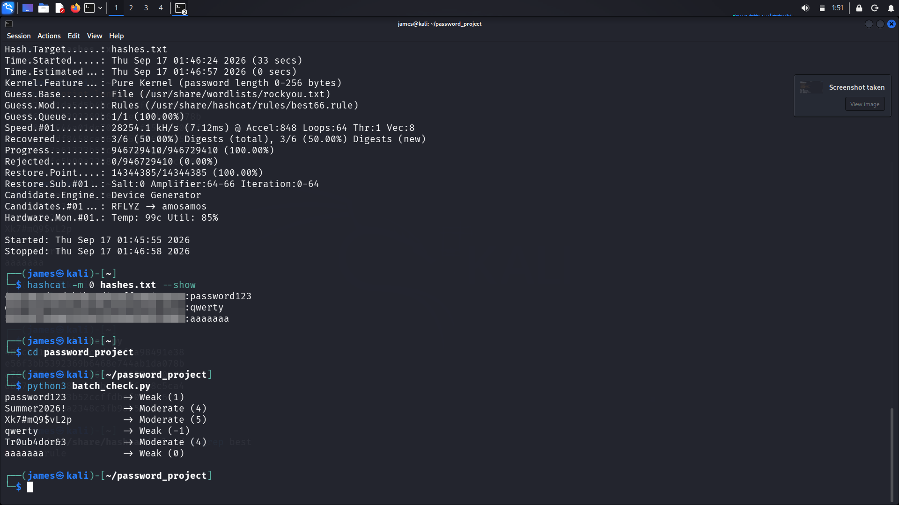
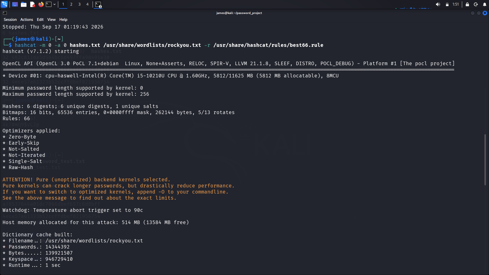

Password Strength Checker & Cracking Lab

A hands-on cybersecurity project exploring the relationship between
theoretical password strength scoring and real-world crackability,
using Python for analysis and Hashcat for practical validation.

Project Goal

Password advice ("use 12+ characters," "add symbols," "avoid common words")
is often given as abstract rules. This project tests those rules against
a real password-cracking tool to see which advice actually holds up
under attack, and which doesn't matter as much as people think.

Components

| File | Purpose |

| "strength_checker.py" | Scores a single password based on length, character variety, common patterns, and repetition |
| "batch_check.py" | Runs a list of test passwords through the checker and prints ratings |
| "hash_passwords.py" | Generates MD5 hashes from a list of test passwords |

Tools Used

1. Python ("hashlib", "re")
2. Kali Linux
3. Hashcat (dictionary + rule-based attack)
4. rockyou.txt wordlist
5. best66.rule (Hashcat rule set for mutation-based guessing)

How It Works

1. Strength scoring — "strength_checker.py" evaluates a password across:
   a.  Length (12+ chars scores highest)
   b. Character variety (lowercase, uppercase, digits, symbols)
   c. Common weak patterns ("password", "123", "qwerty", etc.)
   d. Repeated characters ("aaa", "111")

2. Hash generation — "hash_passwords.py" converts each test password
   into an MD5 hash (intentionally using a weak, unsalted algorithm to
   demonstrate why MD5 is unsuitable for real password storage).

3. Cracking attempt — Hashcat attempts to recover each hash using:
""" bash
    hashcat -m 0 -a 0 hashes.txt /usr/share/wordlists/rockyou.txt -r /usr/share/hashcat/rules/best66.rule
"""

4. Comparison — Ratings from the Python checker are compared against
   which hashes Hashcat actually cracked, and how quickly.

 📸 Screenshots

Password Strength Checker Output
Shows the script scoring passwords of varying strength and returning feedback.

Hashcat Cracking Session
Dictionary + rule-based attack running against the generated hashes using rockyou.txt and best66.rule.

Cracked Results Summary
Output of 'hashcat --show', confirming which hashes were recovered.

 📊 Results Summary

| Password | Checker Rating | Cracked? | Time to Crack |

| 'password123' | Weak | Yes | < 1 sec |
| 'qwerty' | Weak | Yes | < 1 sec |
| 'Summer2024!' | Moderate | Yes | seconds |
| 'Xk7#mQ9$vL2p' | Strong | No | N/A (survived attack) |

🔑 Key Takeaways

1. Length and true randomness matter far more than "adding a symbol" to an
  otherwise predictable password.
2. Dictionary + rule-based attacks (not brute force) are how most real-world
  password cracking succeeds, attackers rely on human predictability.
3. MD5 is fast to crack by design; real systems should use slow, salted
  hashing algorithms like bcrypt or Argon2.

⚠️ Ethical Disclaimer

All passwords and hashes used in this project are self-generated
test data created solely for educational purposes. No real credentials,
accounts, or systems were involved or targeted.

Never attempt password cracking on systems or accounts you do not own
or have explicit written authorization to test.

